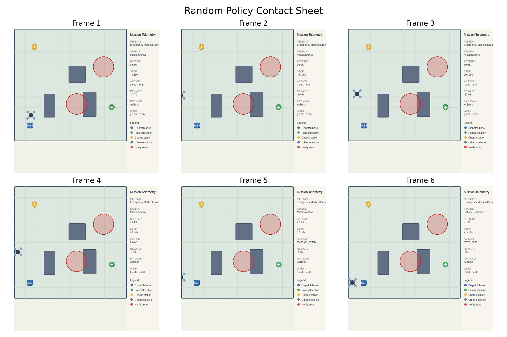
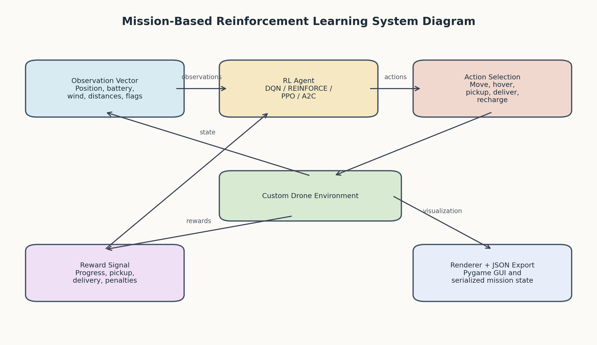
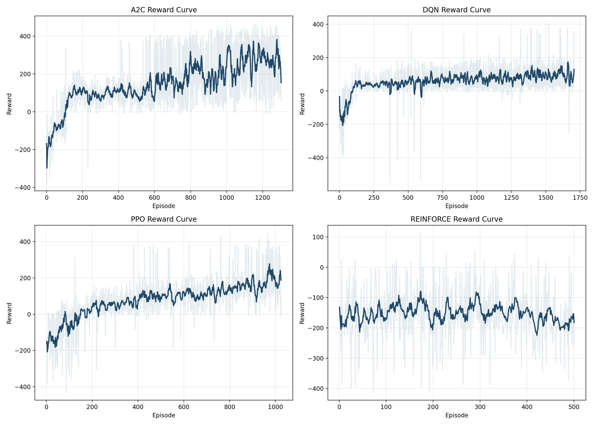
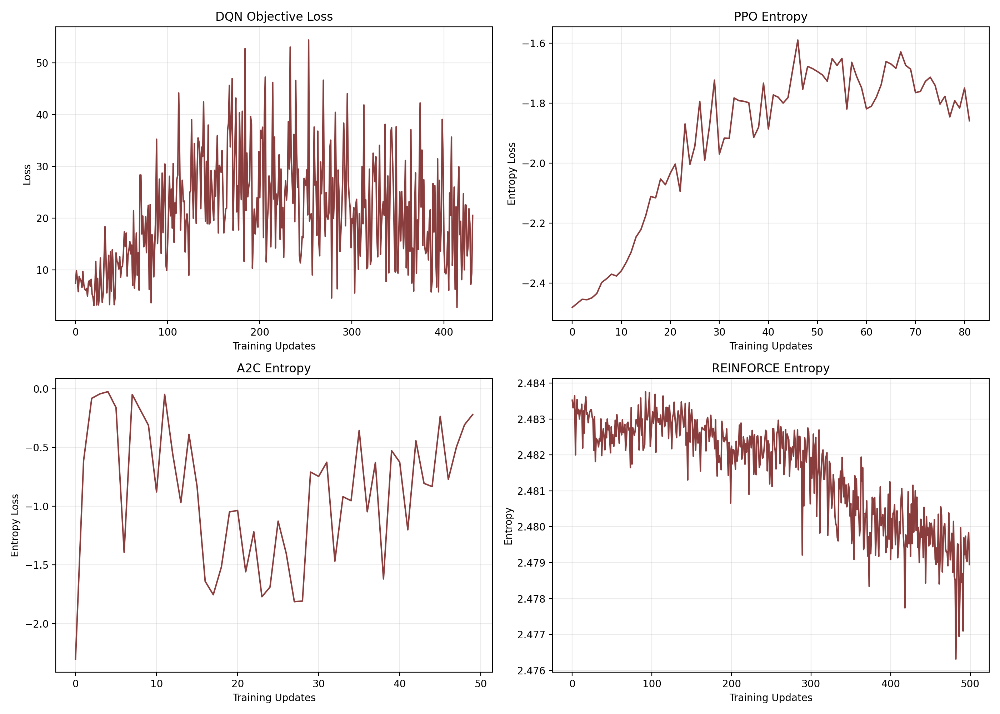
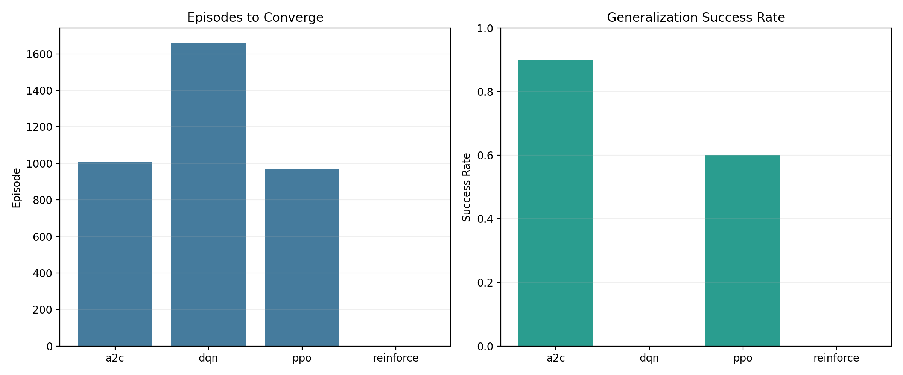

// This file has been removed as per instructions.
// This file has been removed as per instructions.
# Reinforcement Learning Summative Assignment Report

Student Name: `James Jok Dut Akuei`  
Video Recording: `https://youtu.be/nUKbMq-HY8w`  
GitHub Repository: `https://github.com/James-Jok-Akuei/Mission-Based-Reinforcement-Learning`

## Project Overview

This project models an emergency medical drone delivery mission in an urban airspace. The drone must pick up supplies, avoid hazards, manage battery, and deliver to a patient before timeout. Four algorithms were compared on the same environment: DQN, REINFORCE, PPO, and A2C. The goal was to find the method that best balanced reward, mission success, and generalization.

## Environment Description

### Agent(s)

The agent is a single autonomous medical drone. It can move in eight directions, hover, pick up supplies, deliver, and recharge. The environment can also export state data to JSON for possible frontend or API integration.

### Action Space

The action space is discrete with 12 actions:

1. Hover
2. Move North
3. Move South
4. Move East
5. Move West
6. Move North-East
7. Move North-West
8. Move South-East
9. Move South-West
10. Pick Up Supplies
11. Deliver Supplies
12. Recharge Battery

These actions cover movement, package handling, and battery management. The same action space was used for all algorithms for fair comparison.

### Observation Space

The observation is a normalized vector with drone position, mission targets, battery level, remaining steps, package status, goal direction, nearby hazard distances, wind, and proximity flags for pickup, delivery, and recharge. This gives the agent mission-relevant information instead of the full simulator state.

### Reward Structure

The reward function encourages safe and efficient delivery:

- Step penalty: `-0.15`
- Progress reward: proportional to improvement in distance to the active goal
- Pickup bonus: `+30`
- Delivery bonus: `+140`
- Recharge bonus: `+8` plus a small battery-recovery reward
- Invalid action penalty: `-4.5`
- Collision penalty: `-65`
- No-fly-zone violation penalty: `-75`
- Battery depletion penalty: `-55`
- Timeout penalty: `-30`

A concise formulation is:

`R_t = step_penalty + progress_reward + mission_bonus - failure_penalty`

This reward design rewards progress and delivery while penalizing unsafe or wasteful behavior.

### Environment Visualization

The figure below shows a random-action rollout used to confirm that the drone, dispatch base, patient, charging point, obstacles, and no-fly zones were correctly rendered before any model training took place.



Figure 1. Random-action contact sheet showing the custom mission environment and its major components.

## System Analysis And Design

### Agent-System Diagram



Figure 2. System interaction diagram showing how observations, actions, rewards, and visualization components connect in the reinforcement learning pipeline.

### Deep Q-Network (DQN)

DQN was implemented in Stable-Baselines3 with an MLP policy, replay buffer, target network, and epsilon-greedy exploration. It served as the value-based baseline for the discrete action space. Across ten runs, DQN gained reward but did not reliably complete deliveries on unseen layouts.

### Policy Gradient Method (REINFORCE)

REINFORCE was implemented in PyTorch because Stable-Baselines3 does not provide a vanilla version. It used an MLP policy, Monte Carlo returns, and entropy regularization. It improved in some runs but remained less stable than PPO and A2C.

### Proximal Policy Optimization (PPO)

PPO was implemented in Stable-Baselines3 with clipped updates, generalized advantage estimation, and entropy regularization. It was one of the strongest methods, showing better stability and delivery success than DQN and REINFORCE. Its best run generalized well to unseen layouts.

### Actor-Critic (A2C)

A2C was implemented in Stable-Baselines3 with synchronous actor-critic updates. The critic reduced variance while the actor learned the policy. A2C produced the best overall reward, success rate, and final mission behavior, so it was chosen for the demo.

## Implementation

### DQN

| run_name | learning_rate | gamma | buffer_size | batch_size | exploration_fraction | mean_reward | success_rate | convergence_episode |
| --- | --- | --- | --- | --- | --- | --- | --- | --- |
| dqn_run_01 | 0.001 | 0.95 | 10000 | 64 | 0.2 | 86.23335476899175 | 0.0 | 1528 |
| dqn_run_02 | 0.00075 | 0.97 | 15000 | 64 | 0.22 | 109.23542385031973 | 0.0 | 1124 |
| dqn_run_03 | 0.0005 | 0.98 | 20000 | 128 | 0.15 | 82.71142151510223 | 0.0 | 1679 |
| dqn_run_04 | 0.0003 | 0.99 | 30000 | 128 | 0.1 | 59.29955207403945 | 0.0 | 959 |
| dqn_run_05 | 0.00025 | 0.985 | 25000 | 64 | 0.18 | 274.06524926757737 | 0.0 | 1659 |
| dqn_run_06 | 0.0002 | 0.99 | 35000 | 128 | 0.12 | 76.65633879886627 | 0.0 | 1274 |
| dqn_run_07 | 0.00015 | 0.995 | 40000 | 256 | 0.1 | 95.81156746508432 | 0.0 | 1017 |
| dqn_run_08 | 0.0001 | 0.97 | 18000 | 64 | 0.25 | 42.79316970010412 | 0.0 | 1191 |
| dqn_run_09 | 8e-05 | 0.99 | 50000 | 256 | 0.08 | 111.30663435018103 | 0.0 | 2133 |
| dqn_run_10 | 5e-05 | 0.995 | 60000 | 256 | 0.05 | 105.15137499681168 | 0.0 | 2157 |

### REINFORCE

| run_name | learning_rate | gamma | hidden_dim | entropy_coef | normalize_returns | episodes | mean_reward | success_rate |
| --- | --- | --- | --- | --- | --- | --- | --- | --- |
| reinforce_run_01 | 0.001 | 0.95 | 128 | 0.01 | True | 350 | -233.31250736094057 | 0.0 |
| reinforce_run_02 | 0.0007 | 0.97 | 128 | 0.015 | True | 400 | -121.0155474503644 | 0.0 |
| reinforce_run_03 | 0.0005 | 0.98 | 256 | 0.01 | True | 450 | 19.708818903129146 | 0.0 |
| reinforce_run_04 | 0.0003 | 0.99 | 256 | 0.02 | True | 500 | -165.4643733702798 | 0.0 |
| reinforce_run_05 | 0.0002 | 0.995 | 256 | 0.005 | True | 550 | -146.02630211076877 | 0.0 |
| reinforce_run_06 | 0.00015 | 0.97 | 128 | 0.03 | False | 400 | -97.78558090404022 | 0.0 |
| reinforce_run_07 | 0.0001 | 0.985 | 192 | 0.02 | False | 450 | -74.23669137477873 | 0.0 |
| reinforce_run_08 | 8e-05 | 0.99 | 256 | 0.01 | False | 500 | 89.83776952094108 | 0.0 |
| reinforce_run_09 | 5e-05 | 0.995 | 256 | 0.005 | False | 550 | -435.83335504055015 | 0.0 |
| reinforce_run_10 | 3e-05 | 0.997 | 256 | 0.001 | False | 600 | -166.2005001103637 | 0.0 |

### PPO

| run_name | learning_rate | gamma | n_steps | batch_size | gae_lambda | ent_coef | clip_range | mean_reward | success_rate | convergence_episode |
| --- | --- | --- | --- | --- | --- | --- | --- | --- | --- | --- |
| ppo_run_01 | 0.0003 | 0.99 | 512 | 64 | 0.95 | 0.01 | 0.2 | 137.94486474608422 | 0.0 | 719 |
| ppo_run_02 | 0.00025 | 0.98 | 512 | 128 | 0.95 | 0.015 | 0.2 | 281.2399902524058 | 0.6 | 971 |
| ppo_run_03 | 0.0002 | 0.99 | 1024 | 128 | 0.97 | 0.02 | 0.25 | 111.08629576159842 | 0.0 | 938 |
| ppo_run_04 | 0.00015 | 0.995 | 1024 | 256 | 0.98 | 0.01 | 0.15 | -82.62231853485136 | 0.0 | 1045 |
| ppo_run_05 | 0.0001 | 0.99 | 2048 | 256 | 0.95 | 0.005 | 0.2 | 69.45975875854467 | 0.0 | 1103 |
| ppo_run_06 | 0.0003 | 0.97 | 256 | 64 | 0.92 | 0.02 | 0.25 | 101.0920319795649 | 0.0 | 1005 |
| ppo_run_07 | 0.0002 | 0.985 | 512 | 64 | 0.9 | 0.03 | 0.2 | 232.50701297282814 | 0.4 | 1098 |
| ppo_run_08 | 0.00012 | 0.995 | 1024 | 128 | 0.99 | 0.008 | 0.18 | 68.99475875854466 | 0.0 | 1224 |
| ppo_run_09 | 8e-05 | 0.99 | 2048 | 256 | 0.95 | 0.002 | 0.12 | 64.59751794124914 | 0.0 | 717 |
| ppo_run_10 | 5e-05 | 0.995 | 2048 | 512 | 0.98 | 0.001 | 0.1 | -130.47520940303804 | 0.0 |  |

### A2C

| run_name | learning_rate | gamma | n_steps | ent_coef | vf_coef | mean_reward | success_rate | convergence_episode |
| --- | --- | --- | --- | --- | --- | --- | --- | --- |
| a2c_run_01 | 0.0007 | 0.99 | 5 | 0.01 | 0.25 | 132.14413262383323 | 0.0 | 1066 |
| a2c_run_02 | 0.0005 | 0.98 | 10 | 0.015 | 0.3 | 352.28315213583465 | 0.9 | 1010 |
| a2c_run_03 | 0.0003 | 0.99 | 20 | 0.01 | 0.4 | 236.4369999999989 | 0.0 | 129 |
| a2c_run_04 | 0.00025 | 0.995 | 20 | 0.02 | 0.25 | 291.98204919379646 | 0.7 | 1345 |
| a2c_run_05 | 0.0002 | 0.99 | 40 | 0.005 | 0.5 | 88.71562018913707 | 0.0 | 1030 |
| a2c_run_06 | 0.00015 | 0.97 | 5 | 0.03 | 0.2 | 108.07907437419833 | 0.0 | 483 |
| a2c_run_07 | 0.00012 | 0.985 | 10 | 0.02 | 0.35 | 123.66694989573975 | 0.0 | 1020 |
| a2c_run_08 | 0.0001 | 0.99 | 30 | 0.01 | 0.45 | 69.45975875854467 | 0.0 | 917 |
| a2c_run_09 | 8e-05 | 0.995 | 50 | 0.005 | 0.55 | 69.45975875854467 | 0.0 | 1161 |
| a2c_run_10 | 5e-05 | 0.997 | 60 | 0.002 | 0.6 | 29.223476642038595 | 0.0 |  |

## Results Discussion

### Cumulative Rewards



Figure 3. Cumulative reward comparison for the best-performing run from each algorithm.

The curves show that A2C and PPO outperformed the other methods. A2C achieved the best mean reward of `352.28`, followed by PPO at `281.24`. DQN reached `274.07` but still had `0.00` success rate, meaning it collected reward without finishing the mission. REINFORCE was the weakest and least consistent.

### Training Stability



Figure 4. Training stability figure showing DQN objective loss and policy entropy trends for the policy-gradient methods.

The stability plots show that PPO and A2C learned more smoothly than REINFORCE. Their critic-based updates reduced variance and improved consistency. REINFORCE remained noisy, while DQN improved reward without turning that gain into true mission success.

### Episodes To Converge



Figure 5. Summary figure comparing convergence speed and held-out generalization success across algorithms.

PPO converged earlier than A2C by the reward-trend metric, but A2C produced the better final policy. DQN converged around episode `1659`, PPO around `971`, and A2C around `1010`. REINFORCE did not show clear convergence. These results show that convergence should be read together with success rate.

### Generalization

Generalization was evaluated on unseen seeded mission layouts:

- `A2C a2c_run_02`: mean reward `352.28`, success rate `0.90`
- `PPO ppo_run_02`: mean reward `281.24`, success rate `0.60`
- `DQN dqn_run_05`: mean reward `274.07`, success rate `0.00`
- `REINFORCE reinforce_run_08`: mean reward `89.84`, success rate `0.00`

These results show that A2C generalized best and was the most reliable for delivery completion. PPO was the second-best option. DQN and REINFORCE were less dependable under the tested settings.

### Hyperparameter Behavior

The sweeps showed clear patterns. DQN performed best with a moderate learning rate and medium replay buffer, but still failed to complete deliveries. PPO improved with balanced exploration and stable rollout settings. A2C performed best with a moderate learning rate, short rollout horizon, and moderate entropy. REINFORCE improved in some settings but remained unstable.

## Conclusion and Discussion

The best algorithm for this environment was A2C. It achieved the highest reward, the highest success rate, and the strongest final replay behavior. PPO was second and also performed well, but it was less reliable than A2C. DQN collected reward without solving the full task, and REINFORCE remained unstable.

Overall, actor-critic methods were better suited to this emergency drone mission than the tested value-based and vanilla policy-gradient baselines. A2C handled route planning, battery use, and delivery objectives most effectively.


With more time, the project could be improved by refining DQN reward shaping, adding richer hazards, and testing on more unseen layouts. Even in its current form, the system shows a realistic end-to-end RL solution.

## References

Mnih, V., Kavukcuoglu, K., Silver, D., Rusu, A. A., Veness, J., Bellemare, M. G., ... & Hassabis, D. (2015). Human-level control through deep reinforcement learning. Nature, 518(7540), 529–533. https://doi.org/10.1038/nature14236

Schulman, J., Wolski, F., Dhariwal, P., Radford, A., & Klimov, O. (2017). Proximal Policy Optimization Algorithms. arXiv preprint arXiv:1707.06347. https://arxiv.org/abs/1707.06347

Williams, R. J. (1992). Simple statistical gradient-following algorithms for connectionist reinforcement learning. Machine Learning, 8(3-4), 229–256. https://doi.org/10.1007/BF00992696

Environment used:
Farama Foundation. (n.d.). Gymnasium. https://gymnasium.farama.org/

## Final Demo Model

The final model selected for demonstration and video recording is:

- `A2C a2c_run_02`
- Mean reward: `352.28`
- Success rate: `0.90`

Run it with:

```bash
.venv/bin/python main.py --registry-path results/final_demo_model.json --export-trace
```
